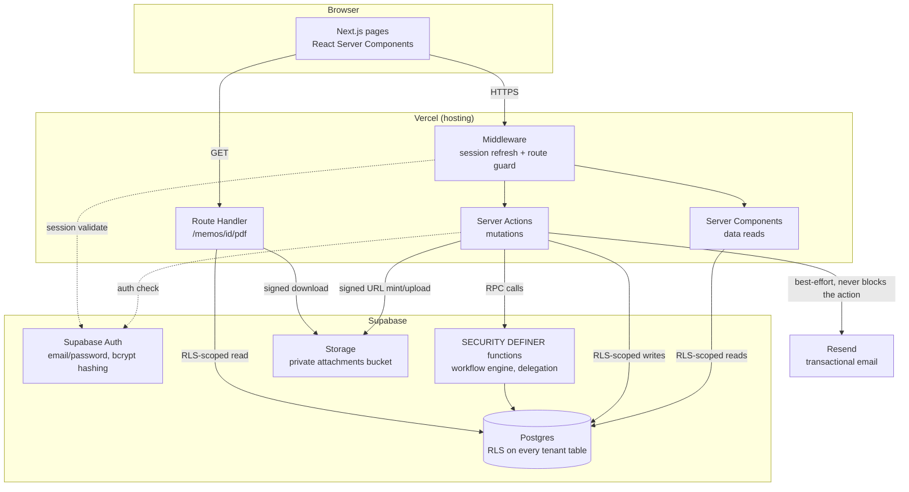

# Relay — Project Documentation

**Course:** CSE226, Foundations of Vibe Coding — NSU, Summer 2026
**Type:** Solo submission
**Deployed app:** https://relay-cyan-alpha.vercel.app/
**Source repository:** https://github.com/arnobalam10-tech/PROJECT-3 *(private — see "Submission
links" at the end of this document for access)*

This document is the standalone project write-up required by the submission checklist. It is
separate from this repo's working documents (`PRD.md`, `DATABASE.md`, `DESIGN.md`, `STATUS.md`,
`CLAUDE.md`), which remain in the repository as the full build history and are referenced below
where useful, but are not required reading to understand this submission.

---

## 1. System overview

Relay is a multi-tenant web application for managing internal office memos that move through a
sequential, but not rigidly fixed, approval workflow — the digital equivalent of a paper memo
routed for physical signatures. A user drafts a memo, defines who needs to weigh in on it (either
freehand or from a reusable position-sequence template), and submits it. From that point, exactly
one person holds the memo at a time; whoever holds it can approve and forward it (to the next
person in the original plan, or to someone new entirely), decline and reroute it without judging
its content, reject it outright, or send it back to the author for changes. Every one of those
actions is permanently recorded, so the full history of a memo — who touched it, what they did,
and when — is always available, even when the actual routing deviated from the plan the author
started with.

Organizations are fully isolated from one another: an organization signs up self-service (like
signing up for a business SaaS product), its admin invites the rest of the org, and nothing in
that org — memos, users, departments, attachments, search results, reports — is ever visible to a
different organization, enforced at the database level as well as in the application code.

## 2. Requirements implemented

Every section of `PRD.md` (itself derived from the course's `CSE226_Summer_26_Project-3.pdf`
spec, refined by the instructor's live Q&A clarifications recorded in `PRD.md` §2.5) was built,
not a reduced subset:

| Area | PRD section | Status |
|---|---|---|
| Multi-tenant org management, self-serve onboarding | §3, §3.1 | Done |
| Authentication (Supabase Auth email/password, protected routes/actions) | §4 | Done |
| Roles & permissions (org admin / regular user, server-side enforced) | §5 | Done |
| Memo creation, drafts, categories, priority | §6 | Done |
| Dynamic workflow engine (holder-discretion routing, not a fixed chain) | §7 | Done |
| Memo status model | §8 | Done |
| Inbox / My Memos / Completed | §9 | Done |
| Memo detail + full timeline | §10 | Done |
| Comments (typed: general/approval/rejection/change-request) | §11 | Done |
| Attachments (signed URLs, size/type validation) | §12 | Done |
| Notifications (in-app + email via Resend) | §13 | Done |
| Search & filtering (tenant- and participation-scoped) | §14 | Done |
| Dashboard (regular user + admin) | §15 | Done |
| Departments | §16 | Done |
| Memo categories | §17 | Done |
| Workflow templates | §18 | Done |
| Delegation | §19 | Done |
| Memo versioning (on change-request/resubmission) | §20 | Done |
| Audit log | §21 | Done |
| Reporting | §22 | Done |
| PDF export | §23 | Done |
| Security requirements checklist | §24 | Done — see §7 of this document |
| UI requirements (landing page, responsive, all required pages) | §25 | Done |
| Seed data + demonstration scenario | §27 | Done — see §6 of this document |

Explicitly out of scope, per §2.5 items 10–11 of the PRD (the instructor's own clarifications) —
not omissions, deliberate exclusions: SSO, MFA, an admin "log in as another user" tool, API keys
for external integrations, a platform-wide super-admin role, org-level data export/import/full
delete tooling, custom DB backup/snapshot features, and API rate limiting/tiers.

## 3. Tech stack

| Layer | Choice |
|---|---|
| Framework | Next.js 16 (App Router), TypeScript, React Server Components + Server Actions |
| Database | Supabase (managed Postgres) |
| Auth | Supabase Auth, email/password |
| File storage | Supabase Storage, private buckets, signed URLs only |
| Styling / components | Tailwind CSS v4, shadcn/ui (Base UI primitives under the hood) |
| Rich text | Tiptap (stored as structured JSON, never raw HTML) |
| Email | Resend |
| PDF export | `@react-pdf/renderer` (server-side, declarative document composition) |
| Hosting | Vercel |
| Version control | GitHub |

The full rationale for each choice (and the two mid-project pivots — see §9) is in `CLAUDE.md` §3
and `STATUS.md`'s phase-by-phase log.

## 4. Architecture

**Request flow, by layer:**
- **Frontend**: Next.js App Router. Every page that requires a session is a Server Component that
  calls `requireProfile()`/`requireOrgAdmin()` before rendering anything; every mutation is a
  Server Action, never a client-side direct database call (there is in fact no browser-side
  Supabase client in this codebase at all — `src/lib/supabase/client.ts` was dead code, removed
  during the Phase 12 security pass).
- **Middleware** (`src/lib/supabase/middleware.ts`) refreshes the session on every request and
  redirects unauthenticated requests away from protected routes *before* any page code runs —
  confirmed server-side, not just client-side routing (see §7).
- **Backend logic** lives in two places by design: ordinary CRUD (departments, profile edits,
  memo drafts) goes through RLS-gated table access from Server Actions; anything with real
  authorization/state-machine logic (the workflow engine, delegation) goes through
  `SECURITY DEFINER` Postgres functions callable only via RPC, so the authorization check lives in
  exactly one place regardless of what client calls it.
- **Database**: Postgres via Supabase, Row Level Security enabled on every tenant-scoped table.
- **Auth**: Supabase Auth (GoTrue) — password hashing, session issuance, and refresh tokens are
  entirely its responsibility; this app never touches a password directly.
- **File storage**: Supabase Storage, one private bucket (`attachments`), accessed exclusively via
  60-second signed URLs minted server-side after an authorization check — never a public bucket
  URL.
- **External service**: Resend for transactional email, called best-effort from Server Actions
  after a workflow action succeeds — an email failure is logged but never fails the underlying
  action.

## 5. Database design & multi-tenancy

Full schema detail lives in `DATABASE.md` (kept in sync with the actual migrations throughout the
build) — this section summarizes the design decisions that matter for grading.

**Tenant isolation pattern**, applied identically to every tenant-scoped table:
1. An `organization_id` column, `NOT NULL`, foreign-keyed to `organizations`.
2. A Postgres RLS policy filtering on `organization_id = private.current_organization_id()`.
3. A server-side re-check of the same `organization_id` in the Server Action on top of RLS — RLS
   is never treated as the only line of defense.

The one subtle trap in this pattern, hit and fixed early in the build: resolving "what's the
caller's own org" via a naive subquery on `profiles` from *inside* `profiles`' own RLS policy is
self-referential and silently locks every user out of their own row (a real bug this project hit
and documented in full in `DATABASE.md`). The fix — and the pattern used everywhere since — is two
`SECURITY DEFINER` helper functions, `private.current_organization_id()` and
`private.current_role()`, which bypass RLS for that one narrow lookup and are only callable from
inside a policy or function (not exposed to the client directly).

**The workflow engine** (`workflow_steps`) is deliberately *not* a fixed, precomputed sequence —
there is no `current_step_position` integer anywhere in the schema. "Who currently holds this
memo" is derived by querying for the one row with `status = 'current'`. This reflects the PRD's
own clarification (§2.5 item 5) that routing is holder-discretion, not a locked chain: a holder
can approve-and-forward to the next planned participant, approve-and-forward to someone entirely
new, decline-and-reroute without judging content, reject outright, or send it back for changes —
and every one of those six PRD-described actions reduces to the same primitive underneath (a
decision + an optional comment + an optional "who's next"), per §2.5 item 8's explicit instruction
not to build separate structural step-types.

Every mutation to `workflow_steps` goes through one of six `SECURITY DEFINER` functions
(`submit_memo`, `workflow_approve`, `workflow_decline_reroute`, `workflow_reject`,
`workflow_request_changes`, `resubmit_memo`) — the table itself has no client-facing
INSERT/UPDATE/DELETE policy at all, so there is exactly one place that can move a memo through its
lifecycle, and exactly one place (`private.assert_current_holder()`) that checks "is the caller
actually allowed to act on this memo right now."

**Multi-tenancy in practice**: two full organizations exist in the seeded demo data
specifically to prove isolation, not just claim it — see §6.

## 6. Workflow design

See `PRD.md` §7 for the full behavioral spec and `DATABASE.md`'s `workflow_steps` section for the
schema-level detail. In short: a memo's author proposes an initial ordered chain of participants
(freehand, or from a workflow template — a reusable named sequence of *positions*, e.g. "Employee
→ Dept Head → Finance → Director", not specific people). Once submitted, exactly one person holds
the memo. That person's options are:

1. **Approve → forward to the next person in the original chain** (the default path).
2. **Approve → forward to someone not in the original chain** — that person then has the same
   discretion, and can continue the original chain, add people, or remove remaining (not-yet-
   reached) people from what's left.
3. **Decline & reroute** — redirect to someone else without approving or rejecting the content.
4. **Reject** — terminates the workflow. Requires a reason.
5. **Request changes** — sends it back to the author for edits. Requires an explanation. A new
   version is recorded; on resubmission the memo re-enters the queue with no special "resume vs.
   restart" logic — routing is decided fresh, the same way it always is.
6. **Comment** without changing who holds the memo.

Every action is permanently logged with who, what, when, and — when the routing deviated from the
original plan — who was added or substituted and by whom, so the timeline stays honest about
deviations rather than only reflecting the original plan.

**Demonstration scenario (PRD §27)** — walked live on the deployed app this session, with evidence
for every one of the 13 required steps (full detail, including exact requests/responses, in
`STATUS.md`'s Phase 11 section). Two organizations were seeded specifically to make this
reproducible without manual setup:

- **Northbridge Logistics** — 1 admin + 4 regular users across 4 departments, a "Purchase Request"
  workflow template (Employee → Dept Head → Finance → Director, the PRD's own example), and 5
  memos covering every state: one in-progress multi-step workflow, one straightforwardly
  approved, one rejected (with a real reason), one that went through change-request →
  resubmission → approval (demonstrating memo versioning), and one still a draft.
- **Fenwick & Vale Partners** — a second, fully separate organization (1 admin + 1 user, 1
  in-progress memo) that exists specifically so cross-tenant denial can be *attempted and shown*,
  not just claimed: a user from this org was signed in and directly requested the first org's
  in-progress memo by its exact UUID (both the memo page and its PDF export) — both returned a
  clean 404, and that user's own search returned zero results for the exact term that finds the
  memo from the correct organization.

**Demo credentials** (all accounts share one password: `RelayDemo2026!`):

| Organization | Name | Email | Role |
|---|---|---|---|
| Northbridge Logistics | Maya Rodriguez | `maya.admin@relaydemo.local` | Org admin |
| Northbridge Logistics | Priya Nair | `priya@relaydemo.local` | Regular user (Operations) |
| Northbridge Logistics | Miguel Torres | `miguel@relaydemo.local` | Regular user (Operations) |
| Northbridge Logistics | Sarah Chen | `sarah@relaydemo.local` | Regular user (Finance) |
| Northbridge Logistics | David Okafor | `david@relaydemo.local` | Regular user (Executive) |
| Fenwick & Vale Partners | Elena Fenwick | `elena.admin@relaydemo.local` | Org admin |
| Fenwick & Vale Partners | Tom Baxter | `tom@relaydemo.local` | Regular user (Consulting) |

## 7. Security

Full checklist detail, including every finding and its verification evidence, is in `STATUS.md`'s
Phase 12 section. Summary by PRD §24 category:

- **Authentication**: Supabase Auth (email/password), password hashing is bcrypt via Supabase's
  own handling (verified directly against `auth.users.encrypted_password` — `$2a$...`, 60
  characters — never rolled in this app). Every protected route is guarded server-side by
  middleware (confirmed via direct HTTP requests with no session cookie: all protected routes
  return `307` to `/login`, not just a client-side redirect).
- **Authorization**: every Server Action calls `requireProfile()`/`requireOrgAdmin()`; the
  workflow engine's authorization additionally lives *inside* the database functions themselves
  (`private.assert_current_holder()`), so it holds even against a request that bypassed the
  Next.js layer entirely and hit Supabase's REST API directly — proven with a real ephemeral
  script: an anonymous caller, a cross-org user, a same-org non-holder, and a same-org
  queued-but-not-current participant were all denied a workflow action on the same real memo.
- **Tenant isolation**: `organization_id` + RLS + server-side re-check on every tenant table (see
  §5). Re-proven fresh this session via the demo scenario's cross-org denial step (§6).
- **File security**: attachments are validated server-side (10MB max, executable-extension
  blocklist) regardless of what the browser's file picker allows, and are only ever reachable via
  a 60-second signed URL minted after an authorization check — never a public bucket URL.
- **Error handling**: a real, fixed finding this session — raw Postgres error messages (which can
  include actual table/constraint names on an unexpected failure) were being forwarded to the
  client in ~20 places. Fixed by distinguishing this app's own deliberate error messages (Postgres
  SQLSTATE `P0001`, from an explicit `raise exception` inside the workflow functions) from every
  other error class, which now gets a generic message instead.
- **Session protection**: a real, fixed finding this session — the Supabase session cookie was not
  `httpOnly` (the library's own default), meaning an XSS bug anywhere in the app could have
  exfiltrated a live session token. Confirmed there was no legitimate reason for this (the app has
  no client-side Supabase usage at all) and forced `httpOnly` on both cookie-writing paths.
- **Self-service privilege escalation**: a real, fixed finding — the RLS policy governing a user
  editing their own profile had no restriction on *which* columns could change, meaning a direct
  API call could self-promote a regular user to org admin or hop them to a different organization.
  Fixed with a database trigger that blocks exactly that, while leaving legitimate admin-managing-
  other-users updates untouched.
- **Transport security**: HTTPS enforced by Vercel (`Strict-Transport-Security` header confirmed
  present on the live deployment); no hardcoded non-`localhost` `http://` URLs anywhere in the
  app.
- **Injection**: all database access goes through the parameterized Supabase client or typed
  `SECURITY DEFINER` function parameters; every migration was grepped for dynamic SQL
  construction (`execute format(...)`) — none exists.

## 8. Vibe-coding process

This project was built end-to-end in Claude Code (Anthropic's agentic CLI), working from a set of
project-operating documents the user maintained throughout (`CLAUDE.md` for working rules,
`PRD.md` for requirements, `DATABASE.md`/`DESIGN.md` for schema/visual system) plus a
continuously-updated `STATUS.md` that served as the single source of truth for what was actually
done, in progress, or still open — read at the start of every session rather than relying on
memory of prior sessions.

**How requirements were communicated**: the user supplied the original course spec as a PRD
document, refined by a second round of instructor Q&A clarifications that explicitly overrode
parts of the original written spec where they conflicted (recorded verbatim in `PRD.md` §2.5, e.g.
the clarification that workflow routing is holder-discretion rather than a fixed chain, and that
"Reviewer" and "Approver" should not be built as separate structural step types). Work proceeded
in the phase order the PRD itself specified (`PRD.md` §26), not skipping ahead to polish while a
core phase was incomplete.

**How output was evaluated — the standard held throughout, not just at the end**: a claim of
"this works" was never accepted on its own. The default verification method was a real, signed-in
end-to-end test — either a live browser walkthrough against the actual running app (local dev
server or, for the phases that needed it, the production Vercel deployment), or an ephemeral
Node.js script using the real `@supabase/supabase-js` client against real signed-in sessions
(created with genuine bcrypt-hashed passwords, not stand-ins), never a mocked database or a
hand-simulated auth context. Authorization claims specifically were proven by attempting the
denied action and confirming both the rejection *and* that the underlying state was genuinely
unchanged afterward (not merely that an error was returned) — this pattern was used dozens of
times across every phase (see `STATUS.md`'s per-phase "Rigor requested by the user" sections for
the full detail).

**How errors were found and fixed**: several real bugs were caught this way rather than by static
review, and are documented in full rather than folded away:
- A search feature that appeared to silently return "no matches" for *every* query — traced to a
  Postgres type error (`jsonb` has no `ilike` operator) that the app wasn't surfacing because a
  query's `error` field was being destructured without a check. Once found, the same audit was
  run across every list/dashboard page in the codebase (not just the one that broke), and the same
  class of gap was found and fixed in every one of them.
- Two self-caught regressions within the same session that introduced them: a migration written
  from a *remembered* version of a database function instead of its actual live definition, which
  silently undid an earlier notification fix — caught by diffing against `pg_get_functiondef()`
  output instead of trusting memory, which became a standing habit for the rest of the build.
- A duplicated/overloaded Postgres function left behind by a `CREATE OR REPLACE` that actually
  created a second function signature rather than replacing the first — caught by directly
  querying `pg_proc` for duplicate names.
- Three security findings in the dedicated security-review phase (self-privilege-escalation via a
  missing RLS column restriction, raw database error leakage, a non-`httpOnly` session cookie) —
  each investigated to a concrete root cause, fixed, and verified with a real before/after test
  rather than assumed fixed once the code looked right. Full detail in `STATUS.md`'s Phase 12
  section.

**Two mid-project pivots, handled as full, disclosed redos rather than quiet patches**: the visual
design system was completely replaced once, after the user reviewed the first (Swiss/Basel-styled)
deployed pass themselves and asked for a different direction — the second pass (`DESIGN.md` v2,
the system live on the deployed app today) was built as a genuine full redo, not a token-level
patch, and both passes are documented in `STATUS.md` rather than the first being erased from the
record.

**How compliance with requirements was verified**: `STATUS.md` was checked, section by section,
against the PRD's own requirement bullets at the end of every phase — not a vague "looks done" —
and any deliberate scope decision or ambiguity resolution was logged with its rationale in
`STATUS.md`'s Decisions Log rather than left implicit. The security review phase specifically
worked through `PRD.md` §24's checklist item by item against the real running application.

## 9. Known limitations

- **Resend email delivery is sandboxed to the developer's own address.** The Resend account used
  for this project has no verified sending domain, so — confirmed by an actual `403` from Resend's
  API, not assumed — transactional emails can currently only be delivered to the account owner's
  own registered address. In-app notifications (the confirmed baseline requirement per PRD §2.5
  item 9) work fully regardless and were demonstrated live; email is a bonus on top of that
  baseline and would need a verified sending domain to reach other real recipients.
- **The PDF export uses Helvetica, not the app's web font.** `@react-pdf/renderer` requires a font
  file to be explicitly registered/embedded for a custom typeface; this was judged not worth the
  added complexity for a visual-only difference, since PRD §23 lists PDF export's *content*
  requirements, not typography matching.
- **No automated test suite.** Verification throughout the project relied on real, live
  script-based and browser-based checks against the actual running app/database (see §8) rather
  than a persisted unit/integration test suite — thorough at the time of each check, but not
  something that re-runs automatically on future changes.
- **A handful of density/wrapping edge cases at unusual viewport widths**, disclosed rather than
  hidden — see `STATUS.md`'s design-pass sections for the specific, already-triaged list; nothing
  affecting a standard desktop or mobile (375px+) viewport.
- **Repository is currently private** — see "Submission links" below for how access is being
  provided for grading.

## 10. Submission links

- **Live application**: https://relay-cyan-alpha.vercel.app/
- **Source code**: https://github.com/arnobalam10-tech/PROJECT-3 — `[ACCESS METHOD TO BE
  CONFIRMED BY THE STUDENT BEFORE SUBMISSION — either the repository is made public, the grader
  is added as a collaborator, or a source ZIP is attached alongside this document instead; see the
  submission checklist review for the open decision]`.
- **AI prompt/response history**: `[TO BE EXPORTED BY THE STUDENT FROM THE ACTIVE CLAUDE CODE
  SESSION BEFORE SUBMISSION — this cannot be generated after the fact; see PRD.md §28's explicit
  reminder]`.
