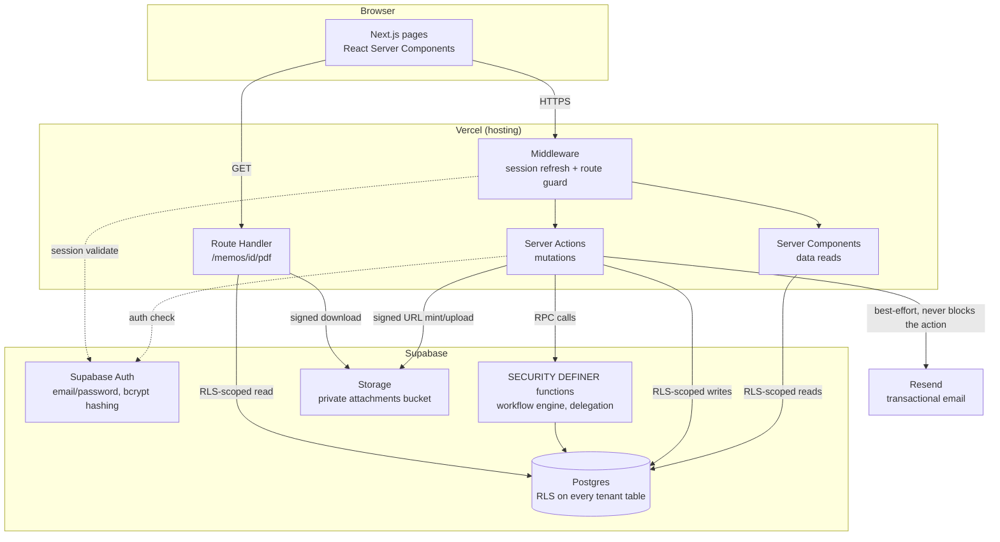

# Relay — Project Documentation

**Course:** CSE226, Foundations of Vibe Coding — NSU, Summer 2026
**Type:** Solo submission
**Live application:** https://relay-cyan-alpha.vercel.app/
**Source repository:** https://github.com/arnobalam10-tech/PROJECT-3

This is the standalone submission document required by `PRD.md` §28.B. It is separate from this
repo's working documents (`PRD.md`, `DATABASE.md`, `DESIGN.md`, `STATUS.md`, `CLAUDE.md`), which
remain in the repository as the full build record and are cited throughout below, but are not
required reading to understand this submission. Every specific fact below — migration names, bug
descriptions, check counts, commit hashes — is pulled from that build record, not written
generically.

---

## 1. System Overview

Relay is a multi-tenant web application for managing internal office memos that move through a
sequential, but not rigidly fixed, approval workflow — the digital equivalent of a paper memo
routed for physical signatures. A user drafts a memo, defines who needs to weigh in on it (either
freehand or from a reusable position-sequence template), and submits it. From that point, exactly
one person holds the memo at a time; whoever holds it can approve and forward it (to the next
person in the original plan, or to someone new entirely), decline and reroute it without judging
its content, reject it outright, or send it back to the author for changes. Every action is
permanently recorded, so the full history of a memo is always available even when routing deviated
from the plan the author started with.

Organizations are fully isolated from one another: an organization signs up self-service, its
admin invites the rest of the org, and nothing — memos, users, departments, attachments, search
results, reports — is ever visible to a different organization, enforced at the database level as
well as the application layer.

## 2. Requirements Implemented

Every section of `PRD.md` was built, not a reduced subset. `PRD.md` §2.5 records live instructor
Q&A clarifications that refine and, in a few cases, directly override the original written spec
(e.g. workflow routing is holder-discretion rather than a fixed chain, "Reviewer"/"Approver" are
not separate structural step types) — those clarifications were treated as authoritative
throughout.

| Area | PRD § | Status |
|---|---|---|
| Multi-tenant org management, self-serve onboarding | §3, §3.1 | Done |
| Authentication (Supabase Auth, protected routes/actions, change password) | §4 | Done |
| Roles & permissions, server-side enforced | §5 | Done |
| Memo creation, drafts, categories, priority | §6 | Done |
| Dynamic workflow engine (holder-discretion routing) | §7 | Done |
| Memo status model | §8 | Done |
| Inbox / My Memos / Completed | §9 | Done |
| Memo detail + full timeline | §10 | Done |
| Comments (typed: general/approval/rejection/change-request) | §11 | Done |
| Attachments (signed URLs, size/type validation) | §12 | Done |
| Notifications (in-app + email via Resend) | §13 | Done |
| Search & filtering (tenant- and participation-scoped) | §14 | Done |
| Dashboard (regular user + admin) | §15 | Done |
| Departments | §16 | Done |
| Memo categories | §17 | Done |
| Workflow templates | §18 | Done |
| Delegation | §19 | Done |
| Memo versioning (on change-request/resubmission) | §20 | Done |
| Audit log | §21 | Done |
| Reporting | §22 | Done |
| PDF export | §23 | Done |
| Security requirements checklist | §24 | Done — see §7 below |
| UI requirements (landing page, responsive, all required pages) | §25 | Done |
| Seed data + demonstration scenario | §27 | Done — see §10.11 below |

Explicitly out of scope per §2.5 items 10–11 (the instructor's own clarifications), not
omissions: SSO, MFA, an admin "log in as another user" tool, API keys for external integrations, a
platform-wide super-admin role, org-level data export/import/full-delete tooling, custom DB
backup/snapshot features, and API rate limiting/tiers.

## 3. Tech Stack

| Layer | Choice |
|---|---|
| Framework | Next.js 16 (App Router), TypeScript, React Server Components + Server Actions |
| Database | Supabase (managed Postgres), 27 migrations, managed via the Supabase MCP connection |
| Auth | Supabase Auth, email/password, bcrypt password hashing (Supabase's own) |
| File storage | Supabase Storage, private `attachments` bucket, 60-second signed URLs only |
| Styling / components | Tailwind CSS v4, shadcn/ui (resolves to Base UI (`@base-ui/react`) primitives, not Radix) |
| Rich text | Tiptap, stored as structured JSON (never raw HTML) |
| Email | Resend |
| PDF export | `@react-pdf/renderer` (chosen over `pdf-lib` — declarative JSX composition fit this codebase's style) |
| Hosting | Vercel |
| Version control | GitHub, 19 commits from foundation to final bugfix |

## 4. Architecture

- **Frontend**: every page requiring a session is a Server Component that calls
  `requireProfile()`/`requireOrgAdmin()` before rendering; every mutation is a Server Action. There
  is no browser-side Supabase client in this codebase — `src/lib/supabase/client.ts` existed early
  on but was dead code (nothing ever imported it) and was deleted during the Phase 12 security pass.
- **Middleware** (`src/lib/supabase/middleware.ts`) refreshes the session and redirects
  unauthenticated requests away from protected routes before any page code runs — confirmed
  server-side by requesting 11 protected routes with no session cookie against the live deployment
  and getting `307` to `/login` on all 11, not a client-side redirect.
- **Backend logic** splits by risk: ordinary CRUD (departments, profile edits, memo drafts) goes
  through RLS-gated table access from Server Actions; anything with real state-machine/
  authorization logic (the workflow engine, delegation) goes through `SECURITY DEFINER` Postgres
  functions callable only via RPC, so the authorization check lives in exactly one place — proven
  by the fact that a request that bypasses the Next.js layer entirely and hits Supabase's REST API
  directly is still denied (see §7).
- **Database**: Postgres via Supabase, RLS enabled on every tenant-scoped table.
- **Auth**: Supabase Auth (GoTrue) owns password hashing, session issuance, and refresh; this app
  never touches a raw password.
- **File storage**: one private bucket (`attachments`), reachable only via a 60-second signed URL
  minted server-side after an authorization check.
- **External service**: Resend, called best-effort from Server Actions after a workflow action
  succeeds — an email failure is logged but never fails the underlying action.

## 5. Database Design & Multi-Tenancy

Full schema detail lives in `DATABASE.md` (kept in sync with the actual migrations throughout the
build). 27 migrations were applied in total, from `001_organizations_and_profiles` through
`027_restrict_profile_self_update_columns`.

**Tenant isolation pattern**, applied identically to every tenant-scoped table:
1. An `organization_id` column, `NOT NULL`, foreign-keyed to `organizations`.
2. A Postgres RLS policy filtering on `organization_id = private.current_organization_id()`.
3. A server-side re-check of the same `organization_id` in the Server Action on top of RLS.

**The self-referential RLS trap, hit for real and now the canonical documented pattern**:
migration 004 exists specifically because the first attempt at this pattern resolved a caller's
own org via a naive subquery on `profiles` from *inside* `profiles`' own RLS policy — a
self-reference with no non-recursive base case, which locked every user out of even their own
profile row and produced a real, fully-reproduced `/login` ↔ `/dashboard` redirect loop. The fix,
used everywhere since, is two `SECURITY DEFINER` helper functions —
`private.current_organization_id()` and `private.current_role()` — that bypass RLS for that one
narrow lookup. The same trap was proactively avoided twice more later in the build by recognizing
the pattern before writing new code: once for `workflow_steps`' own participant-visibility policy
(Phase 4, solved with `private.is_workflow_participant()`), and once for `profiles`' `SELECT`
policy generally.

**The workflow engine** (`workflow_steps`) is deliberately not a fixed, precomputed sequence —
there is no `current_step_position` column anywhere in the schema (confirmed directly via
`information_schema.columns` in Phase 5, 14 columns, no such field). "Who currently holds this
memo" is derived by querying for the one row with `status = 'current'`. This reflects PRD §2.5
item 5: routing is holder-discretion, and every one of the six PRD-described actions (approve
forward-in-chain, approve forward-to-new, decline-and-reroute, reject, request-changes, comment)
reduces to the same underlying primitive, per §2.5 item 8's explicit instruction not to build
separate structural step-types. Every mutation to `workflow_steps` goes through one of six
`SECURITY DEFINER` functions (`submit_memo`, `workflow_approve`, `workflow_decline_reroute`,
`workflow_reject`, `workflow_request_changes`, `resubmit_memo`) — the table itself has no
client-facing INSERT/UPDATE/DELETE policy at all.

**Multi-tenancy proven, not just claimed**: the seeded demo data (§10.11) includes two full
organizations specifically so isolation can be attempted and shown, not just asserted — a user
from the second organization was signed in and directly requested the first organization's memo by
its exact UUID (both the page and its PDF export) and got a clean `404`.

## 6. Workflow Design

See `PRD.md` §7 and `DATABASE.md`'s `workflow_steps` section for the full spec. In short: a memo's
author proposes an initial ordered chain of participants (freehand, or from a workflow template —
a reusable named sequence of positions, e.g. "Employee → Dept Head → Finance → Director", not
specific people). Once submitted, exactly one person holds the memo. That person can:

1. **Approve → forward to the next person in the original chain** (the default path).
2. **Approve → forward to someone not in the original chain** — that person then has the same
   discretion.
3. **Decline & reroute** — redirect without approving or rejecting the content.
4. **Reject** — terminates the workflow. Requires a reason.
5. **Request changes** — sends it back to the author for edits. Requires an explanation. A new
   version is recorded (`memo_versions`); on resubmission the memo re-enters the queue with no
   special "resume vs. restart" logic — routing is decided fresh, the same as always.
6. **Comment** without changing who holds the memo.

Every action is permanently logged with who, what, when, and — when routing deviated from the
original plan — who was added or substituted and by whom.

**Proven with a real ephemeral test, not just described**: Phase 4's verification round drove 73
checks across two rounds against real signed-in users, including confirming a non-holder (a queued
participant, the memo's own author when not current holder, a different-org user entirely) is
denied server-side with zero side effects, that forwarding outside the original chain genuinely
creates a new participant row positioned correctly, and that reject/request-changes/decline
produce three genuinely distinct database states, not just three button labels.

## 7. Security

Full checklist detail, findings, and verification evidence are in `STATUS.md`'s Phase 12 section.
Summary by `PRD.md` §24 category:

- **Authentication**: Supabase Auth, bcrypt password hashing (`auth.users.encrypted_password`
  confirmed directly: `$2a$...`, 60 characters, never rolled in this app). Every protected route is
  guarded server-side by middleware, confirmed via direct HTTP requests with no session cookie.
- **Authorization**: every Server Action calls `requireProfile()`/`requireOrgAdmin()`; the
  workflow engine's authorization additionally lives inside the database functions themselves
  (`private.assert_current_holder()`) — proven with a real script: an anonymous caller, a
  cross-org user, a same-org non-holder, and a same-org queued-but-not-current participant were
  all denied a workflow action on the same real memo, 6/6 checks.
- **Tenant isolation**: `organization_id` + RLS + server-side re-check on every tenant table (§5).
- **File security**: attachments validated server-side (10MB max, executable-extension blocklist)
  regardless of the browser's file picker; only reachable via a 60-second signed URL minted after
  an authorization check.
- **Password change**: added post-launch after being found missing (§10.14) — requires the current
  password, verified server-side via a real `signInWithPassword` re-authentication call before
  `auth.updateUser()` is ever invoked. Confirmed empirically (not assumed) that Supabase Auth
  automatically invalidates other sessions' refresh tokens on a password change (a second
  session's refresh token is rejected — `Invalid Refresh Token: Refresh Token Not Found` —
  immediately after), while a pre-change short-lived access token (JWT) remains valid only until
  its own natural ~1 hour expiry, which is standard stateless-JWT behavior.
- **Three real security findings from the dedicated Phase 12 review**, each found, fixed, and
  verified against the real database/app:
  1. `profiles_update_self`'s RLS policy had no restriction on *which* columns a self-update could
     touch — a regular user could self-promote to `org_admin` or reassign their own
     `organization_id`/`department_id`/`status` via a direct API call. Fixed with a `BEFORE UPDATE`
     trigger (migration 027) that blocks exactly that while leaving admin-on-other-users updates
     untouched. 13/13 checks passed.
  2. ~20 server actions forwarded raw Postgres `error.message` to the client — confirmed real RLS
     violations (code `42501`) and constraint violations (code `23505`) leak actual table/
     constraint names, while this app's own deliberate `raise exception` messages (code `P0001`)
     are safe. Fixed with `toSafeErrorMessage()`, applied at every Postgres/PostgREST call site,
     deliberately leaving Supabase Auth's own already-curated error messages untouched.
  3. The Supabase session cookie was not `httpOnly` (the library's own default) — confirmed via
     `document.cookie` in a real session. Confirmed there was no legitimate reason for it (the
     browser-side Supabase client was dead, unimported code) and forced `httpOnly` on both
     cookie-writing paths; verified the session still works end-to-end afterward.
- **Transport security**: HTTPS enforced by Vercel (`Strict-Transport-Security` header confirmed
  present on the live deployment); no hardcoded non-`localhost` `http://` URLs anywhere in the app.
- **Injection**: all database access goes through the parameterized Supabase client or typed
  `SECURITY DEFINER` function parameters; every migration was grepped for dynamic SQL
  (`execute format(...)`) — none exists.

## 8. Vibe-Coding Process

This project was built end-to-end in Claude Code, working from project-operating documents the
user maintained throughout (`CLAUDE.md` for working rules, `PRD.md` for requirements,
`DATABASE.md`/`DESIGN.md` for schema/visual system) plus a continuously-updated `STATUS.md` that
served as the single source of truth for what was actually done, in progress, or open — read at
the start of every session rather than relying on memory of prior ones.

**How requirements were communicated**: the user supplied the original course spec as a PRD,
refined by a second round of instructor Q&A clarifications that explicitly override parts of the
original written spec where they conflict (`PRD.md` §2.5). Work proceeded in the exact phase order
`PRD.md` §26 specifies (see §10 below), not skipping ahead to polish while a core phase was
incomplete.

**How output was evaluated**: a claim of "this works" was never accepted alone. The default was a
real, signed-in end-to-end test — either a live browser walkthrough against the actual running app
(local dev server, or the production Vercel deployment when the phase called for it), or an
ephemeral Node.js script using the real `@supabase/supabase-js` client against real signed-in
sessions (genuine bcrypt-hashed passwords, not stand-ins). Authorization claims specifically were
proven by attempting the denied action and confirming the underlying state was genuinely unchanged
afterward, not merely that an error was returned — used dozens of times across every phase (73/73
in Phase 4, 15/15 in Phase 5, 11/11 in Phase 6, 39/39 in Phase 8, 17/17 for attachments, 6/6 and
13/13 in Phase 12).

**How errors were found and fixed** — several real bugs, documented in full rather than folded
away:
- A search feature that silently returned "no matches" for *every* query — traced to a Postgres
  type error (`jsonb` has no `ilike` operator) the app wasn't surfacing because a query's `error`
  field was destructured without a check (Phase 7). The same audit was then run across every
  list/dashboard page in the codebase, not just the one that broke, and found the identical gap in
  11 files / ~30 query sites, all fixed identically.
- Two self-caught regressions within the same session that introduced them (Phase 8): a migration
  written from a *remembered* version of a database function instead of its actual live
  definition, which silently undid an earlier notification fix — caught by diffing against
  `pg_get_functiondef()` output instead of trusting memory, which became a standing habit for the
  rest of the build. Separately, a `CREATE OR REPLACE` that added a parameter actually created a
  second overloaded function rather than replacing the first — caught by directly querying
  `pg_proc` for duplicate names.
- Three security findings in the dedicated review phase (§7) and, after the initial submission
  push, two more real bugs found by the user testing the *deployed* app directly: a completely
  dead profile-menu dropdown (root-caused to a Base UI component contract requirement invisible by
  code inspection alone — reproduced on the live URL first, then diagnosed locally where React
  keeps full error text) and a missing change-password feature (confirmed missing via grep before
  building, not assumed).

**Two mid-project pivots, handled as full, disclosed redos rather than quiet patches**: the visual
design system was completely replaced once, after the user reviewed the first (Swiss/Basel-styled)
deployed pass themselves and asked for a different direction — the v2 modern-SaaS system live
today was built as a genuine full redo, and both passes remain documented in `STATUS.md` rather
than the first being erased from the record.

**How compliance was verified**: `STATUS.md` was checked against the PRD's own requirement
bullets at the end of every phase, and every deliberate scope decision or ambiguity resolution was
logged with its rationale in `STATUS.md`'s Decisions Log rather than left implicit. The security
review phase worked through `PRD.md` §24's checklist item by item against the real running
application; the demonstration scenario (§27) was walked live on the deployed app with evidence
for all 13 required steps, not inferred from the seed script's exit code.

## 9. Known Limitations

- **Resend email delivery is sandboxed to the developer's own address.** The Resend account has no
  verified sending domain — confirmed by an actual `403` from Resend's API during Phase 6
  verification, not assumed — so transactional email can currently only reach the account owner's
  own registered address. In-app notifications (the confirmed baseline per §2.5 item 9) work fully
  regardless, demonstrated live in Phase 11's walkthrough.
- **The PDF export uses Helvetica, not the app's web font.** `@react-pdf/renderer` requires a font
  file to be explicitly registered/embedded for a custom typeface; judged not worth the added
  complexity for a visual-only difference, since PRD §23 lists PDF export's content requirements,
  not typography matching.
- **No automated test suite.** Verification throughout relied on real, live script-based and
  browser-based checks against the actual running app/database rather than a persisted unit/
  integration test suite — thorough at the time of each check, but doesn't re-run automatically on
  future changes.
- **A handful of density/wrapping edge cases at unusual viewport widths**, disclosed rather than
  hidden in `STATUS.md`'s design-pass sections; nothing affecting a standard desktop or mobile
  (375px+) viewport.
- **Repository is currently private** — see §11 for the access implication.

## 10. Build Phase History (PRD.md §26)

Every phase below is drawn directly from `STATUS.md`'s real build record, including the bugs each
one actually surfaced.

### 10.1 Foundation

Next.js 16 scaffold, Supabase project connected via the Supabase MCP, base schema (`organizations`,
`profiles`, enums) + RLS (migrations 001–002), Supabase Auth wired, `.env.example`, GitHub repo
initialized, Vercel project connected. Confirmed working end-to-end in production, not just
locally. *Commit `da6406a`.*

### 10.2 Orgs, Users, Departments, Roles

Department CRUD, admin user management (invite/role/department/status), role-gated navigation,
`requireProfile()`/`requireOrgAdmin()` established as the pattern used everywhere from this point
on. Rebranded from a generic placeholder name to "Relay" across the app. `organizations.created_by`
added (migration 006). A real process event: the user's own edit to `DATABASE.md` (applying the
§2.5 instructor clarifications) was based on an older version of the file than this session had
already corrected, silently reverting the tenant-isolation bugfix documentation — flagged to the
user rather than silently overwritten, then merged so both sets of changes survived. *Commits
`f791a0f`, `5fcd743`.*

### 10.3 Memo Core

`memo_categories` (7 PRD-specified defaults auto-seeded per org), `memos` table (no
`current_step_position`, by design — see §5), atomic per-org `memo_number` generation via
`insert ... on conflict do update`, `attachments` + private Storage bucket, a Tiptap rich-text
editor, 10MB/executable-blocklist file validation enforced server-side. **Bug found and fixed**:
the delete-draft button used the browser's native `window.confirm()` — untestable by browser
automation and inconsistent with the design system; replaced with an in-app two-step confirm.
**Investigated and cleared**: a rich-text save that looked blank on first render turned out to be
local dev-mode hydration timing, not a save-path bug — re-verified against the *production* build
with a polling loop that found the real content present within 0.1ms of the check running.
**Verified via script, 17/17 checks**: attachment upload/download/authorization, including
confirming an anonymous client and a different-org user are both denied at the storage layer
itself (not just the app), with the anonymous case failing closed because `anon` has no `EXECUTE`
grant on the RLS helper functions at all. *Commits `5fcd743`, `37a1e0f`, `0567832`.*

### 10.4 Workflow Engine

Six `SECURITY DEFINER` functions (`submit_memo`, `workflow_approve`, `workflow_decline_reroute`,
`workflow_reject`, `workflow_request_changes`, `resubmit_memo`), migrations 011–017. A
self-referential-RLS trap (see §5) was proactively avoided before writing `workflow_steps`' own
SELECT policy by introducing `private.is_workflow_participant()`. The partial unique index
enforcing exactly one `current` row (`unique (memo_id) where status = 'current'`) was explicitly
confirmed with the user as per-memo, not global, before creation. **73/73 checks passed** across
two rounds of ephemeral script testing (real signed-in users, real HTTP), covering non-holder
denial, cross-org denial, forwarding outside the original chain, immutability of resolved steps,
and that reject/request-changes/decline produce three distinct database states. **Two real bugs
found only by running the test script**: a `CASE` expression resolving to `text` instead of the
target enum inside a function body, and — separately — `memo_versions` had been documented since
Phase 1 but never actually created, only surfacing when `submit_memo` tried to write to it. **One
UI bug found and fixed**: the timeline showed the same comment text twice (once from
`workflow_steps.comment`, once from the separate `comments` row). *Commit `1f7d016`.*

### 10.5 Inbox / My Memos / Completed

Schema-level proof that "current holder" is genuinely derived, not stored (`information_schema.
columns` queried directly — 14 columns on `memos`, no position field). **15/15 script checks**
using three real users (an original participant, one added mid-chain outside the original plan,
one with zero involvement ever) proved visibility widens correctly when someone is added and never
widens for an uninvolved party, including after the workflow completes. Migration 018 makes
`memos.updated_at` move on workflow/comment activity, not just direct edits, so "last activity
date" means what it says. *Commit `6e2f359`.*

### 10.6 Notifications

Audited all 8 PRD §13 trigger types against what Phase 4 already wrote, rather than assuming
coverage — found one real gap: "user assigned to a workflow" only ever fired for the *first*
participant, so someone third in a five-person chain wouldn't know they were on it until everyone
ahead of them acted. Fixed in migration 019. **11/11 boundary checks** confirmed a same-org
uninvolved user (and even an org admin) cannot see another user's notifications, and cannot mark
one read via a direct RLS `UPDATE` attempt. **Real email delivery verified**, not just a `200`
response: queried the Resend API directly for the resulting message IDs and confirmed
`last_event: "delivered"` with subject lines matching the triggering event type. This also
surfaced the Resend sandbox constraint documented in §9. *Commits `a6963da`, `b8d1fc3`.*

### 10.7 Search, Dashboard, Reporting

`/search`, `/dashboard` (regular + admin sections), `/admin/reports`. **Real bug found only by
actually searching, not by reading the query**: `memos.body` is `jsonb`, which has no `ilike`
operator — every single search request failed silently and looked identical to "no matches."
Fixed with `memos.body_text`, a trigger-maintained plain-text mirror (migration 020). The user then
asked whether this failure *shape* was isolated — it was not: the same "destructure `data` without
checking `error`" gap existed in 11 files across every list/dashboard/detail page in the codebase,
fixed identically everywhere with a shared `logQueryError()` helper. *Commits `247885d`,
`5169d73`.*

### 10.8 Templates, Delegation, Versioning, Audit Log

`workflow_templates`, `delegations` (migrations 021–026), `workflow_steps.acted_by` +
`comments`/`audit_log.on_behalf_of_user_id` for delegate dual-attribution. **Two self-caught
regressions within the same session that introduced them**: a migration written from a
*remembered* function body instead of its actual live version silently undid the Phase 6
notification fix (caught by diffing `pg_get_functiondef()` output against what was expected, not
trusting memory); separately, adding a parameter via `CREATE OR REPLACE` created a stale duplicate
function overload rather than replacing it (caught by querying `pg_proc` directly). **39/39
delegation checks passed** (an initial round surfaced 5 unexpected passes that were traced to
test-isolation leftovers, not an authorization bug, then re-run clean). Versioning was proven by
having an authorized non-author participant read a *non-latest* version through normal RLS and
confirming it still resolves. Audit log immutability was proven specifically for an org_admin
attempting `UPDATE`/`DELETE` — both matched zero rows. *Commit `c0f92b6`.*

### 10.9 PDF Export

`@react-pdf/renderer`, chosen and recorded per `CLAUDE.md`'s "pick one, log it" instruction. A
naive raw-bytes substring check on the downloaded PDF initially looked like content was missing —
actually a false negative from `@react-pdf/renderer`'s `FlateDecode` compression, caught before
drawing the wrong conclusion by re-verifying with an actual PDF parser instead. Authorization
proven three ways on the same draft memo: a same-org uninvolved user got 404, a different-org user
got 404, the actual author got 200 with a real PDF. A prior write-up's claim that a package (`react
-pdf`) was "unused dead weight" turned out to be false (it never existed separately from
`@react-pdf/renderer`) and was corrected in place rather than left standing. *Commit `3389e2e`.*

### 10.10 Design Pass (two full passes)

**Pass 1 (Swiss/Basel)**: applied `DESIGN.md`'s original system — 3px top bar, Archivo, hairline
dividers, the single red accent reserved for act-now signals. An accent-usage audit found and
fixed 3 real violations (color used for a merely-informational state rather than an actionable
one) and a genuine no-op hover-state bug on dashboard stat tiles. *Commit `65b5e06`.*

**Pass 2 (v2, modern SaaS)** — a full redo, not a patch, after the user reviewed the deployed Pass
1 themselves and asked for a different direction. Adopted shadcn/ui, which resolves to Base UI
(`@base-ui/react`) primitives rather than Radix — a non-obvious dependency choice that changed the
correct composition pattern app-wide. Live-browser QA at mobile and default widths found and fixed
4 real layout bugs in two custom landing-page product mockups, a non-functional filter (a shadcn
`Select` with no submit wiring, replaced with a `SelectFilter` client component), 7 instances of a
Base UI anti-pattern (composing `Button` with a `Link`/`<a>` via its `render` prop, which Base
UI's own docs say breaks button semantics), and a nav overflow at an unusually narrow width.
*Commit `7a742bb`.*

### 10.11 Seed Data + Demo Walkthrough

Two organizations were seeded via a real script driving the app's actual RPCs (not hand-rolled
rows): **Northbridge Logistics** (1 admin, 4 regular users, 4 departments, a "Purchase Request"
template matching PRD §18's own example, 5 memos covering every status — in-progress, approved,
rejected, change-requested→resubmitted→approved, and a draft) and **Fenwick & Vale Partners** (1
admin, 1 user, 1 in-progress memo) — a second org specifically so cross-tenant denial could be
attempted, not just claimed. The script itself caught a real bug in *its own* code via RLS: a
hardcoded organization id left over from writing Org A first was correctly rejected when reused for
Org B's memo. All 13 §27 demonstration steps were then walked live on the deployed app, including
signing in as an Org B user and requesting Org A's memo by its exact UUID (page and PDF export both
→ clean 404) and confirming that user's own search returns zero cross-org results. *Part of commit
`6741813`; see §12 for the full demo credentials.*

### 10.12 Security Review Pass

`PRD.md` §24's checklist worked through item by item against the real running app — see §7 for the
three findings and the full verification evidence for every item. *Commit `9b7926a`.*

### 10.13 Documentation + Submission Packaging

This document, `README.md` updated with the live URL and demo credentials, and a real gap caught
while packaging: migration 027 (the Phase 12 self-update-column fix) had been applied directly to
the live database via the Supabase MCP but never committed as a tracked `.sql` file — caught by
comparing `git ls-files supabase/migrations` against the database's own migration history, then
verified byte-identical to what's actually live before committing. *Commit `6741813`.*

### 10.14 Post-Submission Bugfixes

Found by the user testing the deployed app directly, after the initial submission push:
- **The profile-menu dropdown was completely dead in production.** Reproduced on the live URL
  first. Root cause: `DropdownMenuLabel` (which wraps Base UI's `Menu.GroupLabel`) was used
  without the `Menu.Group` wrapper that component requires, crashing the popup's render before it
  ever opened — the same class of Radix-vs-Base-UI surprise the v2 design pass hit repeatedly.
  Fixed and re-verified on a genuinely fresh browser tab against the live production URL.
- **No change-password feature existed**, despite being an explicit PRD §4 requirement — confirmed
  via grep before building, not assumed. Built requiring the current password (see §7), and
  verified end-to-end via the real UI on both a local and the live production instance using
  throwaway test accounts, never the real demo credentials. *Commit `f7c80af`.*

## 11. Demo Credentials

Two separate organizations, to demonstrate tenant isolation per PRD §27/§28.E. Every account
shares the same password.

| Organization | Name | Role | Email | Password |
|---|---|---|---|---|
| Northbridge Logistics | Maya Rodriguez | Org Admin | `maya.admin@relaydemo.local` | `RelayDemo2026!` |
| Northbridge Logistics | Priya Nair | Regular User (Operations) | `priya@relaydemo.local` | `RelayDemo2026!` |
| Northbridge Logistics | Miguel Torres | Regular User (Operations) | `miguel@relaydemo.local` | `RelayDemo2026!` |
| Northbridge Logistics | Sarah Chen | Regular User (Finance) | `sarah@relaydemo.local` | `RelayDemo2026!` |
| Northbridge Logistics | David Okafor | Regular User (Executive) | `david@relaydemo.local` | `RelayDemo2026!` |
| Fenwick & Vale Partners | Elena Fenwick | Org Admin | `elena.admin@relaydemo.local` | `RelayDemo2026!` |
| Fenwick & Vale Partners | Tom Baxter | Regular User (Consulting) | `tom@relaydemo.local` | `RelayDemo2026!` |

Full seed-data build log and demo-scenario walkthrough evidence: `STATUS.md`, "Phase 11 — Seed
data + full demo scenario walkthrough."

## 12. Submission Links

- **Live application**: https://relay-cyan-alpha.vercel.app/
- **Source code (ZIP)**: https://github.com/arnobalam10-tech/PROJECT-3/archive/refs/heads/main.zip
  — **note**: the source repository is currently **private**; this archive link will not resolve
  for anyone without repo access until it's made public or the grader is added as a collaborator.
- **Source repository**: https://github.com/arnobalam10-tech/PROJECT-3
- **AI prompt/response history**: https://drive.google.com/file/d/12a2Z0VDrYl3Cy1iKel2DFIUsx-ZTjfQ8/view?usp=sharing
